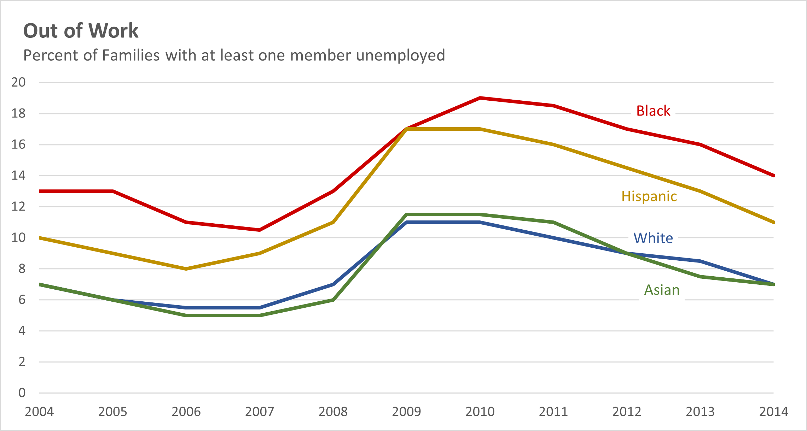
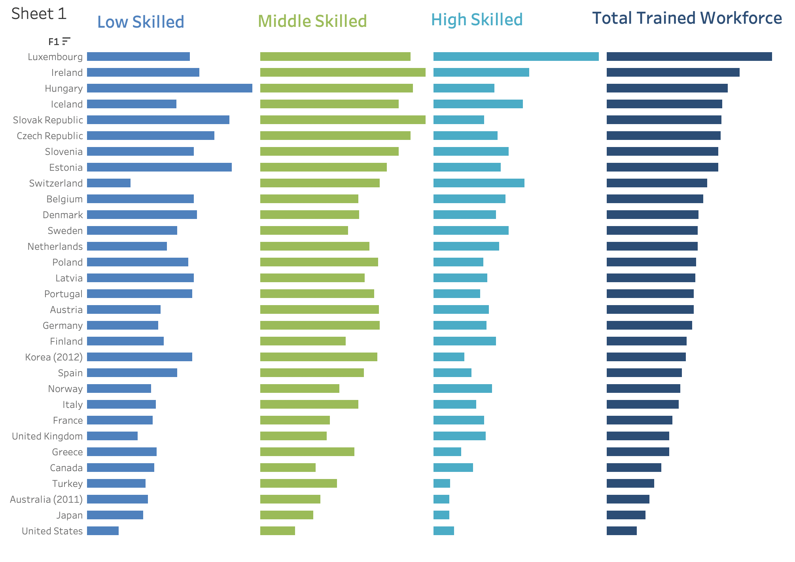

HW3 - Recreate Charts, CS625, Fall 2022
================
Brock Briggs
2022-10-05

# Report

## Part 1

Selection: Line Chart 1

Original

|  | article: [Remake: Paired Column Chart from WSJ](https://policyviz.com/2018/03/01/remake-paired-column-chart-from-wsj/) Excel data file: [PolicyViz_WSJ_Remake.xlsx](http://policyviz.com/wp-content/uploads/2018/02/PolicyViz_WSJ_Remake.xlsx) |
|-----------------------------------------------------------------------------------------------------------------------|----------------------------------------------------------------------------------------------------------------------------------------------------------------------------------------------------------------------------------------------------|

My Re-creation

1.  Description: Method - Excel

-   Started with downloaded the excel document the data was in.
-   Selected all the data, insert, line chart
-   Excel automatically used the same vertical axis and date axis
-   Selected each line individually and format data series menu comes up
    on the right. Select color as close of match as possible and
    repeated for each line.
-   Change auto generated chart title to ‘Out of Work’, line break, add
    ‘Percent of families with at least one member unemployed’. Left
    align chart title. Out of Work bolded. Second line font size changed
    to 11.
-   Under chart design tab, used quick layout to change to layout 6
    which puts legend on the chart. This also added an axis title which
    I removed. This also reoriented title, changed back.
-   Manually selected each legend data series. Removed ‘value’ to be
    shown.Removed leader line.
-   Manually oriented line data series title to position of original
    chart, roughly between 2012-2013 years and upped font to 10.
-   Gave each a data label ‘white’ fill color in order to interrupt the
    chart grid lines
-   Selected x axis to format and changed axis position to on tick marks
    to make data go edge to edge.

2.  Assessment: Re-creation

I was able to re-create the original chart nearly perfect. The original
picture feels a bit brighter as a whole, like a higher resolution photo.
Aside from that, all elements of the chart are consistent with the
original.

2.  Assessment: Tool - Excel

There wasn’t a ton of need for flexibility on this chart, but generally
excel can keep things incredibly clean. Puts together charts of tables
extremely well. I’ve spent a lot of my life working in excel and that
experience makes everything feel ‘natural’, but I think it would be
intuitive to someone who has never used it. Excel absolutely met the
needs of recreating this chart.

3.  Explain

The ease of putting this chart together shows that excel was the right
tool to use in order to recreate this. The legend data labels was the
hardest part of this chart. It’s unclear looking at the original whether
they manually moved them around or if it was settings - I couldn’t find
a setting that would allow them to be perfectly lined up.

## Part 2

Selection: Small Multiples Bar Chart

Original

|  | article: [Remaking an OECD Stacked Bar Chart](https://policyviz.com/2017/11/30/remaking-oecd-stacked-bar-chart-general-comments/) Excel data file: [PolicyViz_OECD_Skills_Data.xlsx](http://policyviz.com/wp-content/uploads/2017/11/PolicyViz_OECD_Skills_Data.xlsx) |
|----------------------------------------------------------------------------------------------------------------------|---------------------------------------------------------------------------------------------------------------------------------------------------------------------------------------------------------------------------------------------------------------------------|

My Re-creation

1.  Description: Method - Tableau

-   Started with downloading the downloaded file.
-   Given there were multiple charts in the file, I had to find the data
    chart was coming from. One thing I noticed was that the original
    photo is actually mislabeled. Because the chart isn’t labeled
    properly, you don’t know what lowest skill / highest skill means.
    The excel chart in the file downloaded actually shows that the
    lowest skill label and highest skill title’s should be flipped. I
    made my chart to reflect the original, wrongly labeled chart.
-   Because I’m not using excel for this design, made note of the colors
    used in the table by writing down the hex number. 4F81BD, 9BBB59,
    4BACC6, 2C4D75.
-   Copied just the data and put onto a clean excel sheet.
-   Opened tableau, connected to data source on the left hand side and
    selected my file. Drug the sheet name onto the page to tell it I
    wanted to use that data source and clicked sheet 1.
-   On the left grabbed high skill (first category in the chart) and
    drug it onto the sheet. Tableau automatically chooses sum of the
    value which is what we want. Because there’s no country name column,
    it’s actually just called F1 the title of the table, drug that onto
    the sheet.
-   This automatically produced a bar graph of the countries by high
    skill. At the top in columns/rows sections, swapped F1 to rows and
    High Skill to columns. This makes the bar graph vertical rather than
    horizontal.
-   Grabbed medium skill low skill and total and drug them to the
    columns portion at the top of the page.
-   Went to marks section and clicked on each column title (high -
    Total)
-   Clicked color and filled in bars with appropriate colors noted
    earlier. Also under marks, all, selected size and adjusted all the
    bars to be of similar size to the country names as in the original
-   At bottom of the sheet in total section, hovering over total gives
    you sort options. I sorted from largest to smallest to align with
    original graph.
-   Right Clicked on the bottom box of the skill axis and hit edit
    access.
-   Changed title to blank under axis titles. On tick marks tab, changed
    to none.
-   Click on data and selected format \> format borders, removed column
    and row dividers.
-   Went to format lines and removed grid lines.
-   Tried adjusting the sizing but sizing options are extremely limited.
    Used this tableau forum to find where you could scale to ‘larger’ or
    ‘smaller’ but lack of custom option. Was forced to leave as is. See
    ref 1.
-   Tried increasing the spacing in between the different columns but
    tableau also doesn’t allow that. Solution on this website suggested
    adding a whole other column and making the color white so there
    would be room, but that won’t work for horizontal bars. See ref 2.
-   In the need for a custom title, but unable to get the spacing I want
    to indicate each grouping above the appropriate data.
-   Tried adding a text box, but tableau only allows for text boxes in
    ‘dashboard view’. Added a dashboard and brought in the data. Was
    able to select a floating object from the lower left and put the
    titles in. This caused another problem where it inputs the sheet
    name and sorting mechanism in the upper left with no option to hide
    it. Assuming because dashboards are aggregating multiple data
    sources, it wants you to know where it came from. Tried putting a
    blank text box with fill color over it to hide it, but there’s no
    option for fill color on text boxes. See ref 3.

2.  Assessment: Re-creation

I was able to portray the data and at first glance it would be clear
it’s the same information, but some of the details of the formatting I
was not able to replicate including sizing and removing unnecessary
extras.

-   Bar sizing - While I used the same information to create this chart
    as the data that was in the excel file, I struggled to find why the
    ‘Low Skill’ bars are so small in the original. It almost feels like
    the data was altered in a way to portray smaller values. This is
    also seen in the lack of any way to measure the information
    (original is a chart crime, in my opinion). To do this they graphed
    invisible fillers values in excel which also spaced the groupings
    out.
-   Extras - I was unable to remove the ‘Sheet 1’ and table title ‘F1’
    from the upper left hand corner of the image.

2.  Assessment: Tool - Tableau

Initially the data groups were put together with ease and quickly with
Tableau. The platform allows for dragging and dropping your information
into the sheet and has a good sense for what the data ought to look like
without interfering from the start. What really let me down with using
Tableau was the lack of finer tuning details.

-   As I explained in the description, the titling was extremely
    difficult. Tableau wants you to use one title with their
    predetermined format and that’s it. For this chart, I needed four
    individual titles at specific places in the sheet. To do this I had
    to put the data into a dashboard and then add text boxes which still
    even lacked the ability to ‘fill’ the text boxes with a color. Color
    fill is a basic word processor function we’re used to, but not how
    this tool is designed to be used.
-   Bringing the data to the dashboard also cripples the customization
    further. I speculated in description that dashboards are designed to
    present data from multiple different sources and it would be
    important to know where they came from. I was unable to remove the
    location titles.

Generally, I can see why Tableau would be great for manipulating data
quickly. It took some time to get oriented and some research, per
earlier references, on why certain things are, but it is certainly
powerful. Tableau lacked the fine detail capability I needed to recreate
the chart perfectly.

3.  Explain

The multiple bar graphs in this chart are NOT the appropriate idiom to
portray this information. First off, there is too much information being
displayed. It would be more appropriate to show one category (low,
medium, or high skill) and possibly compare that to the total. Four data
points for each country is too much.

Second, to be able to draw any conclusions from this chart we would need
some way to measure it. Because of the lack of tick marks, the only
assumptions we can make are comparing countries between one skill
category. Even this though can get convoluted with bars seemingly the
same size in some cases. Data labels containing the values could help
here, but could also muddle the data further by clouding it.

If I were to take this information and recreate it in a way that would
be helpful, I would take make one vertical bar chart with the total
value compared to one skill category for each country in a row. This way
you could compare between countries for that skill level as well as
compare within the country, the skill level to the total. This would
include tick marks on the y axis to reflect values and x axis would
dictate country. I would keep the color differentiation between skill
category and total. It would also be helpful, with more information, to
include some context of the chart in the title; we have no idea what
time period this is from. We also don’t know if this is describing a
general skill level as a generalization or if this is a count of people
with that skill level.

### References

-   Ref 1:
    <https://community.tableau.com/s/question/0D54T00000C6TJuSAN/bar-chart-increase-spacing-of-bars>
-   Ref 2:
    <https://senturus.com/blog/tableau-tip-add-space-between-groups-of-bars-in-charts/#>:\~:text=Tableau%20defaults%20to%20no%20spacing%20between%20the%20panes,the%20default%20SUM%20%28%29%20aggregations%20to%20MIN%20%28%29
-   Ref 3:
    <https://www.datameer.com/blog/tableau_how-to-insert-a-simple-text-box-into-a-tableau-worksheet/>
